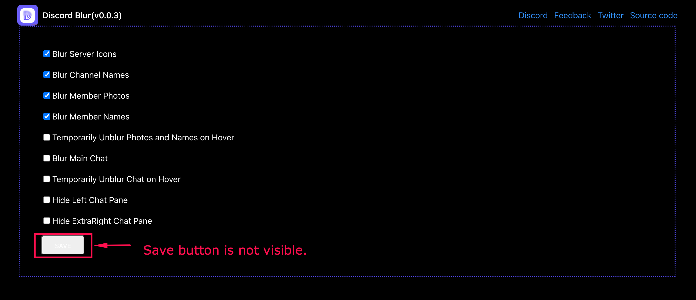

# 🐞 Bug Report: Save Button Not Clearly Visible

## Issue
The "Save" button in the Disblur settings UI is not visually distinguishable or clearly active.

### Evidence

## Impact
- Users might think their settings are not saved
- Reduces trust in the extension

## Suggestion
- Make the Save button style more prominent (e.g. white background, blue border)
- Add toast notification after saving
